# OpenSearch SOC Dashboard

## Обзор проекта
Развернул OpenSearch и OpenSearch Dashboards с нуля на Kali Linux в виртуальной машине VirtualBox. Настроил Host-Only сеть для доступа с хост-машины Mac. Создал дашборд с 15 визуализациями для мониторинга безопасности.

## Что я сделал
- Развернул OpenSearch 2.14.0 на Kali Linux
- Настроил OpenSearch Dashboards 2.14.0 с веб-интерфейсом
- Настроил Host-Only сеть (Mac ↔ Kali)
- Создал 15 кастомных визуализаций
- Проверил здоровье кластера (статус GREEN)

## Инструменты
- Kali Linux
- OpenSearch 2.14.0
- OpenSearch Dashboards 2.14.0
- VirtualBox (Host-Only networking)
- Nmap, Wireshark

---

## Запуск OpenSearch Dashboards

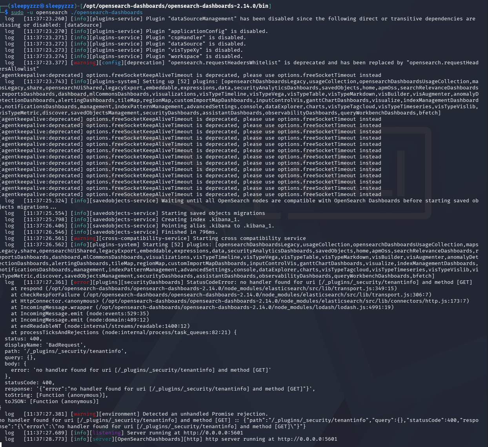

*Успешный запуск OpenSearch Dashboards. В логах видно загрузку 52 плагинов и запуск сервера на `http://0.0.0.0:5601`. Ошибка 400 ожидаема, так как плагин безопасности отключен для данной лабораторной среды.*

---

## Проверка здоровья кластера

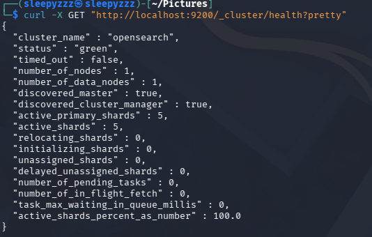

*Проверка состояния кластера OpenSearch через команду `curl`. Кластер достиг статуса "GREEN" — все 5 активных шардов распределены, мастер-нода обнаружена, система полностью работоспособна, 100% активных шардов.*

---

## Переход кластера в статус GREEN

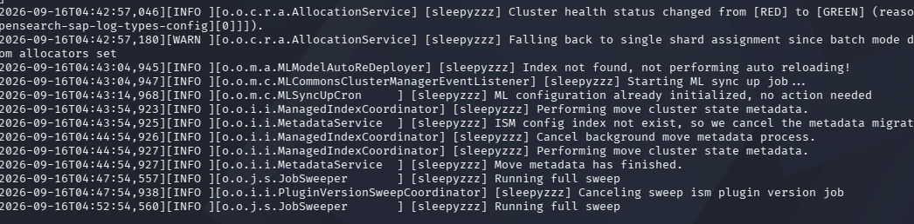

*Момент, когда кластер OpenSearch изменил статус с "RED" на "GREEN". Это означает, что все шарды успешно распределены и система готова к работе.*

---

## Конфигурация OpenSearch

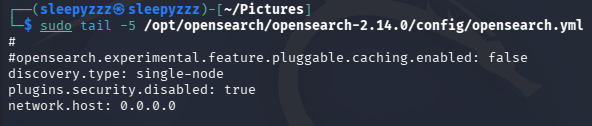

*Настроен файл `opensearch.yml`: привязка ко всем сетевым интерфейсам (`network.host: 0.0.0.0`), режим одиночной ноды (`discovery.type: single-node`), отключен плагин безопасности (`plugins.security.disabled: true`) для доступа по HTTP в лабораторных условиях.*

---

## Настройка Host-Only сети

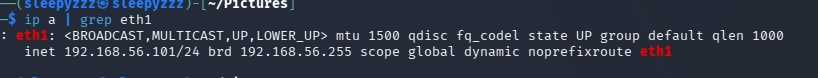

*Интерфейс `eth1` получил IP-адрес `192.168.56.101` через DHCP, что обеспечило выделенный канал связи между виртуальной машиной Kali и хост-машиной Mac.*

---

## Проверка связи между машинами

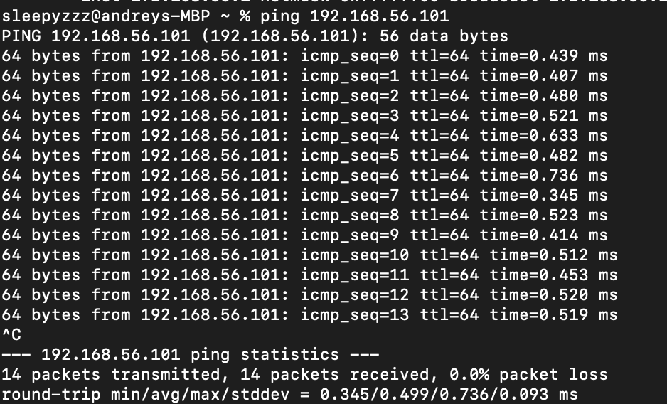

*Успешный ping виртуальной машины Kali с хост-машины Mac с 0% потерь пакетов. Подтверждена корректная настройка Host-Only адаптера и двусторонняя связь.*

---

## Проверка связи (обратное направление)

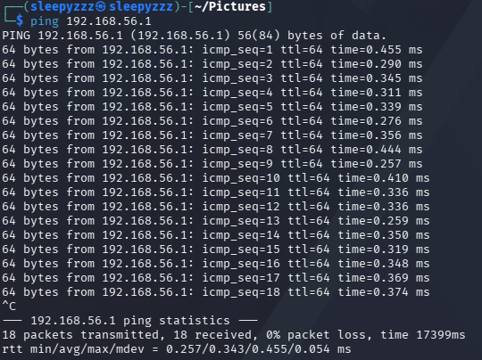

*Проверка связи из Kali в сторону Mac. 18 пакетов отправлено, 18 получено, 0% потерь. Подтверждена двусторонняя связь между машинами.*

---

## Запуск службы OpenSearch

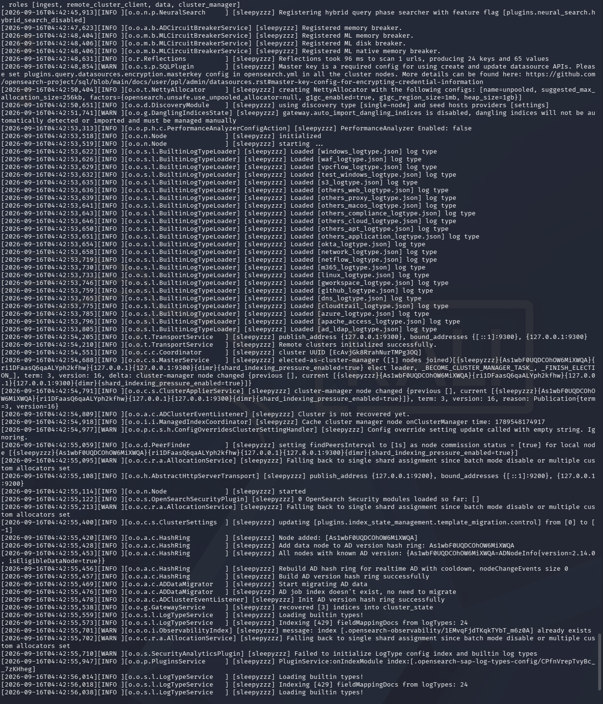

*Запуск OpenSearch от выделенного пользователя. В логах видна успешная загрузка 52 плагинов, настройки Java heap, обнаружение ноды и инициализация движка.*

---

## Проверка OpenSearch через curl

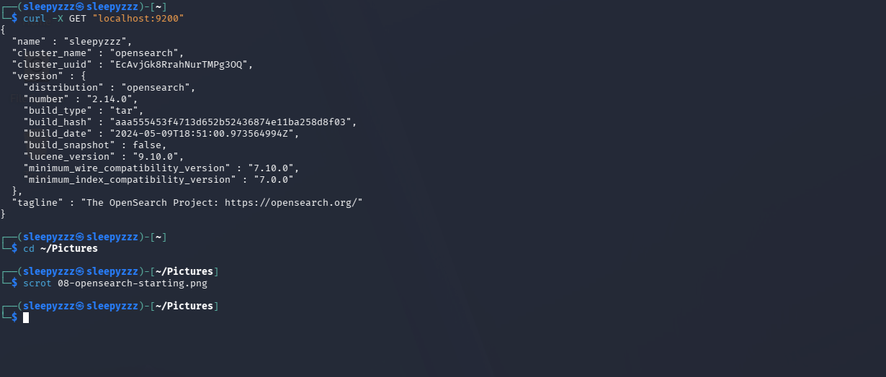

*Проверка работы OpenSearch через команду `curl` на локальном хосте. JSON-ответ подтверждает, что кластер запущен, версия 2.14.0, имя ноды "sleepyzzz".*

---

## Доступ к веб-интерфейсу OpenSearch с хоста

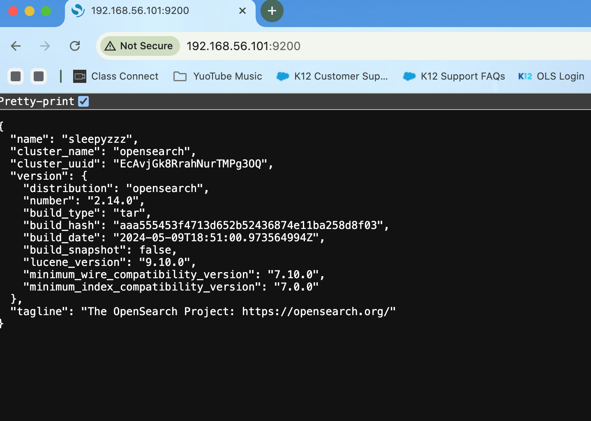

*Успешный доступ к REST API OpenSearch из браузера на Mac по адресу `192.168.56.101:9200`. JSON-ответ подтверждает имя кластера, версию (2.14.0) и статус ноды.*

---

## Страница входа в OpenSearch Dashboards

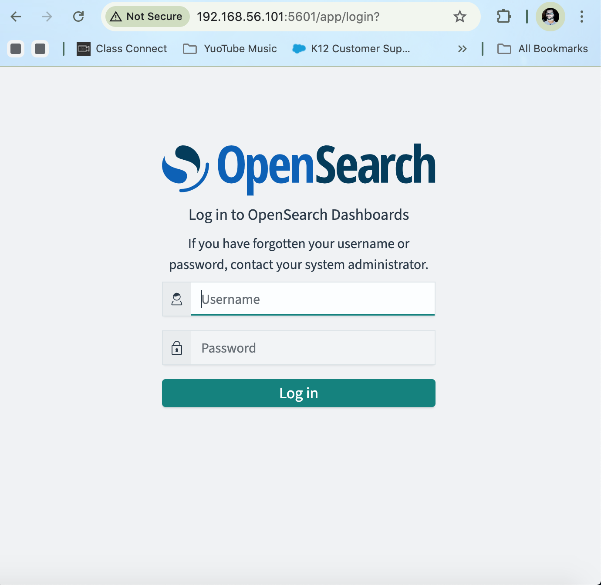

*Доступ к веб-интерфейсу OpenSearch Dashboards с хост-машины Mac. Подтверждена работа компонента визуализации и наличие аутентификации.*

---

## Загрузка тестовых данных

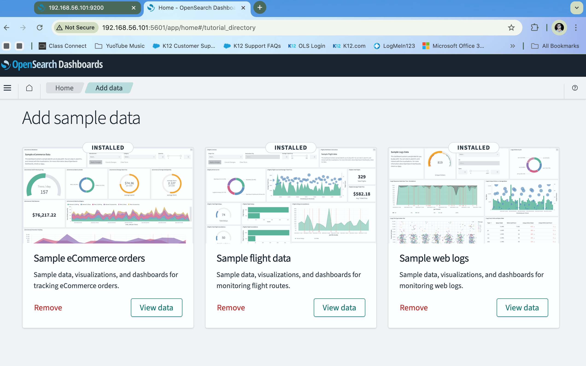

*Загружены три набора тестовых данных (eCommerce, Flight Data, Web Logs) в OpenSearch для имитации реального анализа. Эти данные заполняют дашборды метриками.*

---

## Создание собственного SOC-дашборда

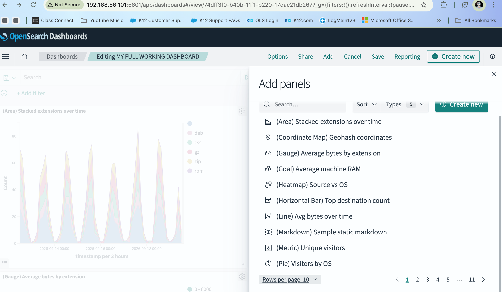

*Создан комплексный дашборд безопасности с 15 уникальными визуализациями: географические карты, метрики, круговые диаграммы и временные ряды. Панели обеспечивают мониторинг сетевого трафика, состояния системы и аномалий в реальном времени.*
